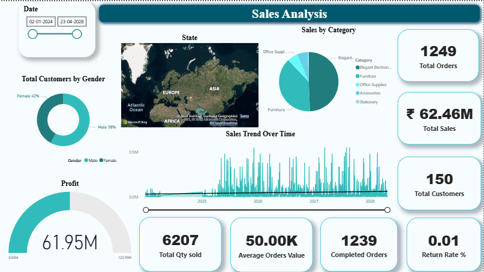

# Sales Analysis Dashboard (Power BI)

# Project Overview

This project presents an interactive Sales Analysis Dashboard built using Power BI to track business performance across regions, categories, and time.

# Key Metrics

* Total Sales: ₹62.46M
* Total Orders: 1249
* Total Customers: 87
* Total Quantity Sold: 6207
* Profit: ₹61.95M

# Key Insights

* Majority of sales are concentrated in specific regions (as shown in map visualization)
* Technology and Furniture categories contribute significantly to overall sales
* Sales show fluctuations over time with noticeable growth trends
* Return rate is extremely low (0.01%), indicating strong customer satisfaction

# Tools & Technologies

* Power BI
* Data Visualization
* Data Cleaning

# Dashboard Preview

# Files Included

* Sales_Analysis.pbix → Power BI file
* dashboard_1.png → Dashboard preview

# How to Use

1. Download the `.pbix` file
2. Open using Power BI Desktop
3. Interact with filters and visuals

# Project Objective

To analyze sales performance and provide actionable insights for better decision-making.

# Author
Mansi Gaikwad

**If you like it give it a star
Thankyou
**
